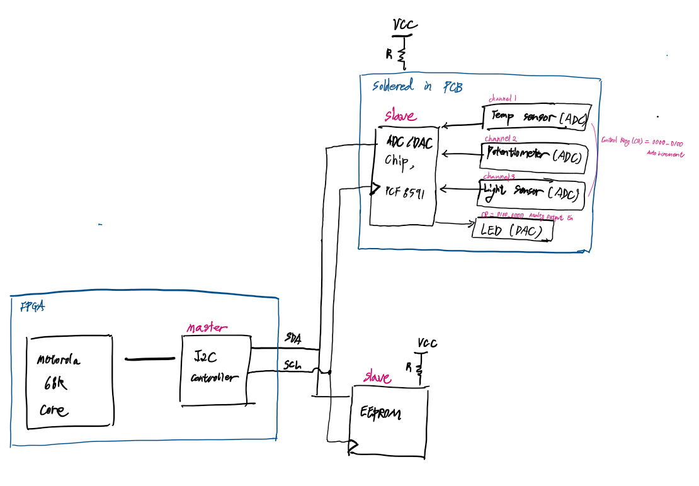

# Lab5: I2C driver Development

## Goal:
Use Motorola 68k softcore process on DE1-SoC FPGA Board, 
1. Develop I2C driver using embedded C so that I2C controller can read/write from I2C slave devices. This is done by setting Control, Transmit, Receive, Command, Status Registers for Wishbone Buses.  
    * Wishbone is an open standard bus designed specifically for FPGAs. 
  
2. Read/write a single Byte or Block up to 128k at any address in the external EEPROM chip through I2C connection
    * unlike flash, EEProme allows byte-by-byte erasing and programming
  

3. Read analog data from ADC/DAC converter through I2C connection.

## Hardware:
* FPGA:
    * DE1-SOC
    * Download motorola68k softcore + I2C controller VHDL code
* EEProm : 
    * Microchip's 24AA1025, 1MB (128k x 8) EEProm
* ADC/DAC converter: 
    * NXP's PCF8591 is soldered to a tiny PCB with three sensors + LED output

## Block diagram :

  

## I2C Master Core:
* Register Configuration:

    Control Register(CTR)
    | Bit           | 7 MSB | 6 | 5 | 4 | 3  | 2  | 1  | 0 LSB |
    |---------------|-------|---|---|---|----|----|----|-------|
    | | Core Enable | Interrupt Enable |  |  |  |  |  |   |

    Command Register(CR)
    | Bit           | 7 MSB | 6 | 5 | 4 | 3  | 2  | 1  | 0 LSB |
    |---------------|-------|---|---|---|----|----|----|-------|
    | | Generate Start | Generate Stop | Read from slave | Write to slave |  |  |  | Interrupt Ack: When set, clears a pending interrupts  |

    Status Register(SR)
    | Bit           | 7 MSB | 6 | 5 | 4 | 3  | 2  | 1  | 0 LSB |
    |---------------|-------|---|---|---|----|----|----|-------|
    | | Receive Ack from slave |  |  |  |  |  |  | Interrupt Flag: set to 1 when interrupt is pending  |

    Transmit Register(TXR): All 8 bits are the next byte to transmit via I2C

    Receive Register(RXR): All 8 bits are the last byte received via I2C

## EEPROM:
* Slave Address:

    | Bit           | 7 MSB | 6 | 5 | 4 | 3  | 2  | 1  | 0 LSB |
    |---------------|-------|---|---|---|----|----|----|-------|
    | slave address | 1     | 0 | 1 | 0 | B0 | A1 | A0 | R/~W  |

    B0: Block select bit. The device divided into two banks of 512K bits. Block select bit to control access to each bank. 

    A1, A0: Chip select bit. Allows to add up to 4 devices. Only one EEPROM is used for this project. Therefore, A1, A0 are set to 0.
    

* Write:

    There are total of 1MB(total memory) / 1Byte(size of each address can hold)= 2^16 addresses. Therefore, upper 8bits and lowers 8bits need to send  

    22AA1025 supports upto page write of 128 bytes at once. Instead of generating a Stop bit, the master transmit up to 127 addition bytes which are stored in the on-chip page buffer, and will be written into memory after stop bit is transmitted.

    1. Byte Write 

    |   |   |   |   |   |   |   |   |   |   |   |   |   |
    |---|---|---|---|---|---|---|---|---|---|---|---|---|
    |start| slave address | Ack | Address High Byte |Ack| Address Low Byte| Ack |Data| Stop|
  

    2. Page Write

    |   |   |   |   |   |   |   |   |   |   |   |   |   |
    |---|---|---|---|---|---|---|---|---|---|---|---|---|
    |start| slave address | Ack | Address High Byte |Ack| Address Low Byte| Ack |Data0| Ack| ... | Data127| Ack| Stop|

## ADC/DAC: 
* Slave Address:

    | Bit           | 7 MSB | 6 | 5 | 4 | 3  | 2  | 1  | 0 LSB |
    |---------------|-------|---|---|---|----|----|----|-------|
    | slave address | 1     | 0 | 0 | 1 | A2 | A1 | A0 | R/~W  |

    A2, A1, A0 is programmable part that is set accodring to the hardware pins A2, A1, A0 which are set to all 0.

* I2C ADC Write:
    |   |   |   |   |   |   |   |   |   |   |
    |---|---|---|---|---|---|---|---|---|---|
    |start| slave address | Ack | Data0 |Ack| Data1| Ack | ... | Stop|

* I2C DAC Read:

    |   |   |   |   |   |   |   |   |   |   |   |   |
    |---|---|---|---|---|---|---|---|---|---|---|---|
    |start| slave address | Ack | ADC's channel number |Ack| Start bit(Sr) | slave Address |  Ack | Data0| Ack from master| ... | stop|

    * Start bit(Sr): repeated start
